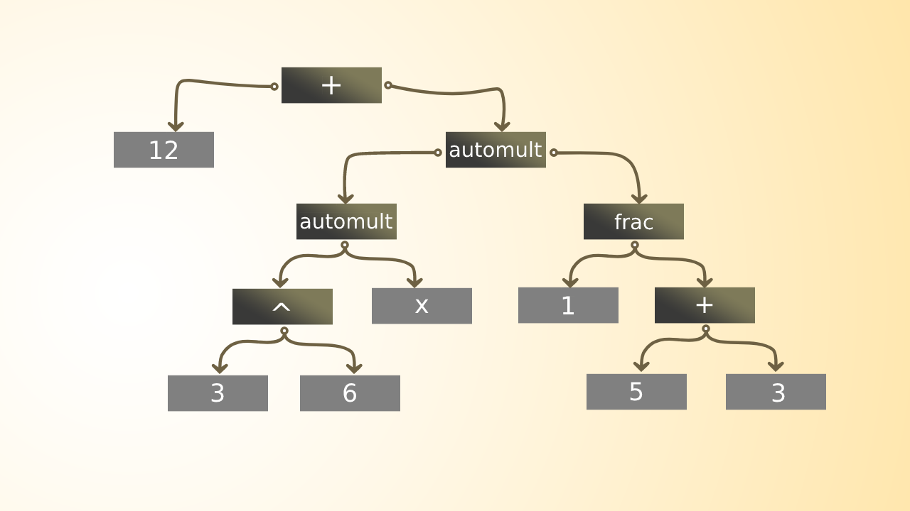

# math-latex-parser
A mathematical parser for latex in math mode. We mean by mathematical that, arithmetic operations are considered. For example, if you pass "1+2", the result would by a (add node "+") with two children nodes of type number.

**See also:** [math-parser](https://github.com/scicave/math-parser)

## Install

```
npm i @scicave/math-latex-parser
```

## Usage

You can also pass options to the parse function:

```js
console.log(parse(tex, options));
```

```js
const {parse} = require('@scicave/math-latex-parser'); 
console.log(parse('12+3^6x \\frac 1 {5+3}'));
```



## Contribute

Feel free to refactor code, enhance the performance,
suggest better AST structure. I love open-source stuff ❤️.

See `(package.json).scripts`.

```sh
❯ npm install
❯ npm run start # watch and built
❯ # open another terminal:
❯ npm run test:watch # test after builing
```

## Operators Schema

| Operator | Precedence | Associativity |
| -------- | ---------- | ------------- |
| `!`      | 6          | N/A           |
| `^`      | 5          | left-to-right |
| `*`      | 4          | left-to-right |
| `/`      | 4          | left-to-right |
| `+`      | 3          | left-to-right |
| `-`      | 3          | left-to-right |
| `!=`     | 2          | left-to-right |
| `>=`     | 2          | left-to-right |
| `<=`     | 2          | left-to-right |
| `>`      | 2          | left-to-right |
| `<`      | 2          | left-to-right |
| `=`      | 1          | left-to-right |

## AST Node

The `parse` function returns a `Node`, which may have array of other `Node`s in its `args`.

### Node.prototype.type

The `Node` type, see the [available types](#nodetypes).

### Node.prototype.check(props: Object)

This method can check all properties except `args`, it will be ignored.

```js
let node = mathLatexParser.parse("\alpha!");
console.log(node.check({
  type: "operator",
  operatorType: "postfix",
  name: "!"
}));
// true
```

### Node.prototype.checkType(type: string)

You can check for `type` directly here, but why not `node.type === "the_type"`?
Because `"the_type"` is not a valid type, `.checkType` will throw if you passed invalid type.

```js
let node = mathLatexParser.parse("1");
console.log(node.checkType("member expression"));
// false
```

### Node.prototype.hasChild(props: Object)

This method can check for any of `args` with properties `props`. It doesn't check for`args`, it will be ignored.

```js
let node = mathLatexParser.parse("1+2");
// { type: "operator", args: [...], operatorType: "infix" }
console.log(node.hasChild({ type: "number", value: 1 }));
// true
```

### Node.prototype.hasChildR(props: Object)

The same as `hasChild`, but recursively.

```js
let node = mathLatexParser.parse("\sin(1+2)");
// { type: "function", name: "sin", args: [...], isBuiltin: true }
console.log(node.hasChildR({ type: "number", value: 1 }));
// true
```

### Node.types

Available values for `Node.prototype.type`.

Array of literal strings: `Node.types.values`.

All Valid operators: `Node.types.operators`.

## Options

### .autoMult

Type = `boolean`, default = `true`.

You can parse some thing like this `3^6cd\sqrt af`, if false, the previous latex expression will throw an error while being parsed.

### .singleCharName

Type = `boolean`, default = `true`.

If you want to use `asdas{d  }  _ {asdasd123}` as id for variable of function (see options.functions here below), you have to set options.singleCharName to false.

### .functions
Type = `Array<`[Checker](#checker)`>`, default = `[]`.

This is useful in some cases like, `f(x)`, or `f\left(x\right)`, the function id here is `f`, you can use `blablabla` when singleCharName is `false`.

### .builtInControlSeq

Type = `Array<`[Checker](#checker)`>`, default:

```json
[
  "alpha", "Alpha", "beta", "Beta", "gamma",
  "Gamma", "pi", "Pi", "varpi", "phi", "Phi",
  "varphi", "mu", "theta", "vartheta", "epsilon",
  "varepsilon", "upsilon", "Upsilon", "zeta", "eta",
  "Lambda", "lambda", "kappa","omega", "Omega",
  "psi", "Psi", "chi", "tau", "sigma", "Sigma",
  "varsigma", "rho", "varrho", "Xi", "xi", "nu",
  "imath", "jmath", "ell", "Re", "Im", "wp", "Nabla",
  "infty", "aleph", "beth", "gimel", "comicron", "iota",
  "delta", "thetasym", "omicron", "Delta", "Epsilon",
  "Zeta", "Eta", "Theta", "Iota", "Kappa", "Mu", "Nu",
  "Omicron", "Rho", "Tau", "Chi"
]
```

### .builtInFunctions

Type = `Array<`[Checker](#checker)`>`, default:

```json
[
  "sinh", "cosh", "tanh", "sin", "cos", "tan", "sec",
  "csc", "cot", "arcsin", "arccos", "arctan", "arcsec",
  "arccsc", "arccot", "ln"
]
```

### .extra

All extra features are enabled.

Example:

```js
mathLatexParser.parse(tex, {
  extra: {
    // ...
  }
});
```

- `memberExpressions`, for example:
  - `p.x`
  - `point.x`
  - `f(x).someProperty.fn(y).result`: valid syntax in both cases of `singleCharName`.
  - .......... etc, and so on.
- `intervals`: true or false, will return node with properties `{ startInlusive: boolean, endInclusive: boolean }`.
  - `[1,2]`
  - `(-.5, infinity)`
  - `(-pi, 1]`
  - `[2,5)`
- `sets`: e.g., `{ 1, sqrt(pi), ..., sqrt(pi)^10 }`
- `tuples`: e.g., `(1, 2, x, ...)`
- `matrices`: e.g., `[ sinx, 1, 3; cosy, sqrt(3), 0 ]`
- `ellipsis`: to allow the 3-dots "...", e.g., `{ 1, 3, 5, ... }`

----------------------

Notes

- You can use ellipsis as valid `Factor`, e.g., `1 + 2 + ... + 10`
- This expression will throw syntax error, `1 + 2 + (...) + 10`
- `extra.ellipsis` is more customizable:
  - `extra.ellipsis.matrices: boolean`
- `extra.ellipsis.tuples: boolean`
  - `extra.ellipsis.sets: boolean`
  - `extra.ellipsis.funcArgs: boolean`
  
- Intervals, should have 2 terms as math expression:
  - `(..., a]`: throw syntax error
  - `(..., a)`: is a tuple, parsed if `extra.ellipsis` is `true`
  - `[..., a]`: is a matrix, parsed if `extra.matrices` is `true`


### Checker

```ts
type Checker = RegExp | ((...args:any[])=>boolean) | Checker[];
```

## License

MIT
